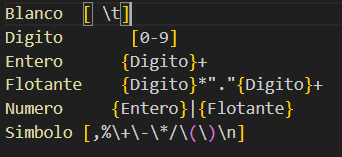

# **Implementación de una Calculadora Científica con Flex y Bison**
## **<ins>Creado por: Jonathan Alejandro Ibáñez Aguilar - 2213026738</ins>**

## Introducción
En este código se utilizó Flex para generar un analizador léxico, mientras que se usó Bison para generar un analizador sintáctico. Estos dos analizadores trabajarán en conjunto para hacer funcionar la calculadora científica de este programa.

Siguiendo el principio Divide y vencerás, debemos dividir esta práctica en pequeñas partes fundamentales para poder desarrollar el código de manera más rápida y efectiva.

## Operaciones
Lo primero que debemos hacer es plantear el funcionamiento que tendrá nuestro programa. Como en este caso estamos elaborando una calculadora científica, lo que debemos hacer es definir las operaciones que se pueden realizar:
1. Operaciones aritméticas:
    - Suma
    - Resta
    - División
    - Multiplicación
    - Módulo
2. Operaciones Trigonométricas
    - Seno
    - Coseno
    - Tangente
3. Operaciones Logarítmicas
    - Logaritmo base 10
    - Logaritmo natural
4. Operaciones extra
    - Potencia
    - Raíz cuadrada
    - Valor absoluto
5. Definición de constantes matemáticas:
    - Pi
    - Constante de Euler

## Archivo .l - Analizador léxico (Flex)
En este archivo debemos colocar las reglas que seguirá nuestro analizador léxico, las cuales generamos con ayuda de expresiones regulares.

### Declaraciones del Archivo .l
Una vez que definimos las operaciones que necesitamos implementar, debemos crear nuestro analizador léxico con ayuda de Flex. Este analizador nos permite identificar cada una de las cadenas que serán aceptadas por el programa.

En la imágen podemos observar las siguientes declaraciones:
- Blanco: Nos sirve para identificar los espacios en blanco y tabulaciones.
- Número: Para poder identificar tanto números enteros como reales.
- Símbolo: Nos permite identificar los símbolos necesarios para realizar las operaciones aritméticas, así como paréntesis, comas y saltos de línea.

### Reglas del Archivo .l

En la imagen podemos observar las reglas del analizador léxico. Cada regla tiene una expresión regular (izquierda) y una acción (derecha). Los valores de retorno en mayúsculas son importantes, ya que deben coincidir con los declarados en el archivo .y.
Podemos agrupar estas reglas en tres grupos principales:
1. **Reglas de informacion**: Las primeras 7 expresiones permiten mostrar al usuarioayuda sobre las operaciones disponibles esta informacion se detalla en el apartado ***Reglas de información***. Las reglas de este grupo son: *aritmeticas, trigonometricas, logaritmos, potencia, raíz, absoluto y constantes*
2. **Reglas de operaciones**: Las siguientes 10 expresiones identifican las funciones y constantes que debe procesar la calculadora. Las reglas de este grupo son: *sin, cos, tan, pi, e, sqrt, pow, abs, log y ln*
3. **Otras reglas**: Las ultimas 5 expresiones regulares permiten realizar las tareas que se listan a continuación:
    - exit: Permite al usuario salir del programa.
    - Blanco: No realiza ninguna acción. Esto quiere decir que solo ignoraremos los espacios en blanco y los tabuladores.
    - Número: Obtiene el valor numerico que se leyó (sin importar si es entero o real) y lo transforma en tipo float.
    - Símbolo: Obtiene el símbolo que se leyó y lo envía como carácter, esto ayuda a identificar la operación que se quiere realizar. Los símbolos aceptados los podemos observar en la parte de ***Declaraciones del Archivo .l***

## Archivo .y - Analizador sintáctico (Bison)
Este archivo contiene la gramática libre de contexto que controla el funcionamiento de la calculadora.

### Declaraciones del Archivo .y

En la imagen podemos ver varios tipos de declaraciones:
- %union: Permite declarar varios tipos de tokens en un solo apartado. Estos tipos son utilizados para especificar el tipo de variable que puede aceptar algun otro token.
- %token NOMBRE: Como su nombre lo dice, nos permite declarar tokens que son la unidad básica de entrada que reconoce el parser.
- %type \<tipo> NOMBRE: Permite especificar el tipo que aceptará un término no terminal.
- %start NOMBRE: Permite específicar el término inicial de nuestra gramática.
- %left NOMBRE: Sirven para definir la prioridad y la asociatividad de los operadores. Cuando se tienen dos operadores con la misma prioridad se agrupan de izquierda a derecha.
- %right NOMBRE: Es lo mismo que left, con la única diferencia que agrupa los operadores con la misma prioridad de derecha a izquierda.

### Grámatica - Parte de las operaciones

En la imágen podemos observar la grámatica de nuestro analizador sintactico. La grámatica la podemos dividir en 2 tipos de términos:
1. No Terminales: Permiten seguir derivando en otras reglas. Los no términales definidos para esta gramática son:
    - linea
    - exp
    - exp_real
2. Terminales: Son los *"puntos finales"* de nuestra grámatica. Cada uno de estos términos tiene un comportamiento asociado. Podemos ver que hay un terminal para cada una de las operaciones que nuestra calculadora puede ejecutar.

Existen otro terminales y no terminales que serán descritos más adelante ya que su propósito es más enfocado al correcto funcionamiento de la calculadora y no a las operaciones que esta puede realizar.

### Manejo de errores sintácticos

En esta parte declaramos los errores sintácticos más básicos que se pueden tener. Si la calculadora detecta que hay 2 o más símbolos de operación seguidos entonces imprime un mensaje de error. Hay una excepción a este caso, y esto es con el símbolo *"-"* debido a que este puede estar después de cualquier otro simbolo de operacion ya que puede ser parte de un número negativo.

### Manejo de errores semánticos
En esta parte declaramos los errores semánticos más básicos que se pueden tener:
1. División sobre 0.

2. Logaritmo de un número negativo

3. Raíz de un número negativo

### Reglas de información

Se crearon un par de reglas para que el usuario pueda obtener ayuda/información acerca de las operaciones que se pueden realizar dentro de la calculadora.

## ¿Cómo ejecutar el programa?
### Requerimientos previos
Para poder ejecutar este programa se necesita lo siguiente:
1. Instalar Flex
2. Instalar Bison
3. Un compilador de C

Debido a que yo estoy realizando este código en Windows me vi en la necesidad de instalar ***MSYS2***. MSYS2 es una plataforma de desarrollo para Windows que proporciona un entorno similar a Unix, una línea de comandos y un sistema de gestión de paquetes. De esta manera pude trabajar en Windows con un entorno que simulaba algún Sistema Operativo de Unix.

### Compilación y Ejecución
Para poder compilar y ejecutar nuestro programa debemos utilizar los siguientes comandos dentro de la terminal ***MSYS2 MINGW64***:
1. ***flex Calculadora.l***: Este comando permite compilar el archivo .l que es el correspondiente a flex, este comando crea un nuevo archivo llamado *lex.yy.c*. Cabe mencionar que la palabra "*Calculadora*" puede ser sustituida por cualquier otro nombre que se le desee dar al programa.
2. ***bison -d Calculadora.y***: Este comando permite compilar el archivo .y que es el correspondiente a bison, este comando crea dos nuevos archivos llamados *Calculadora.tab.c* y *Calculadora.tab.h*. Cabe mencionar que la palabra "*Calculadora*" puede ser sustituida por cualquier otro nombre que se le desee dar al programa.
3. ***gcc -o Calculadora Calculadora.tab.c lex.yy.c -lm /usr/lib/libfl.a***: Este comando es bastante más largo, mas no complejo. Debemos deshacerlo en partes para poder entenderlo de manera rápida y fácil:
    - **gcc**: Es el compilador que vamos a utilizar. Cualquiera que haya trabajado con el lenguaje C conoce este compilador.
    - **-o Calculadora**: -o es una bandera que nos permite darle un nombre personalizado al archivo ejecutable que se genera al finalizar la compilación. *Calculadora* es simplemente el nombre personalizado del ejecutable.
    - **Calculadora.tab.c lex.yy.c**: Estos 2 archivos se generaron automáticamente con los 2 comandos anteriores. Aqui solo decimos que para poder compilar correctamente nuestro programa necesitamos *darle de comer* estos 2 archivos. Se pueden ver (**erróneamente**) como bibliotecas que necesita nuestro programa.
    - **-lm /usr/lib/libfl.a**: -l es una bandera que nos permite enlazar al programa una biblioteca. La letra *m* es para decirle al programa que la biblioteca en cuestión es la biblioteca *math.h*. Finalmente la ruta */usr/lib/libfl.a* es para enlazar la biblioteca de flex a nuestro programa, si estas en un entorno Unix o en una Mac puedes sustituir esta ruta por la ruta donde hayas instalado Flex y Bison, o bien simplemente por *fl* quedando el comando de la siguiente manera **-lm fl**.

Como podemos suponer, ejecutar 3 comandos distintos cada vez que hacemos algún cambio a nuestro programa para poder probarlo es bastante molesto, sin mencionar que uno de ellos es bastante largo y difícil de aprender. Para solucionar este problema generamos un archivo **Makefile**.

### Archivo Makefile

Un archivo Makefile nos permite ejecutar todos los comandos necesarios para la compilación de un programa. Si analizamos el archivo Makefile podemos observar que solo declaramos variables para posteriormente utilizarlas en los 3 comandos que describimos anteriormente.

Teniendo este archivo Makefile podemos ingresar el comando *Make* en nuestra terminal para compilar todo nuestro programa. Esto hace del proceso de compilación algo mucho mas rápido y eficiente.

También tenemos el comando *Make clean* que nos permite eliminar los archivos *Calculadora, Calculadora.tab.c, Calculadora.tab.h y lex.yy.c* que son los 4 archivos generados al momento de compilar nuestro programa.

## Funcionamiento
### Mensajes de ayuda/más información
Como se dijo anteriormente, se crearon varias reglas para que el usuario pueda observar el funcionamiento de la calculadora.

### Demostración de resultados
En la práctica dada por el profesor se solicitaron distintas pruebas de las cuales podemos ver el resultado en la siguiente imágen. Podemos observar que todas las pruebas fueron exitosas, a excepción de la primer prueba pero este fue un error ya que se ingreso la palabra *pa* en lugar de la constante predefinida *pi*.

### Errores sintácticos 
Los errores sintácticos implementados fueron descritos en el apartado ***Manejo de errores sintácticos*** por lo que aquí solo se mostrará el resultado de este manejo de errores.

### Errores semánticos 
Los errores semánticos implementados fueron descritos en el apartado ***Manejo de errores semánticos*** por lo que aquí solo se mostrará el resultado de este manejo de errores.

